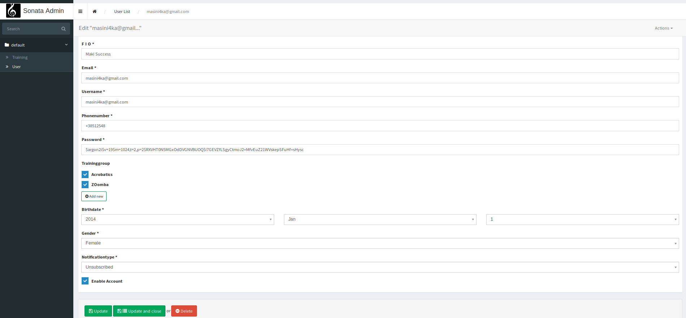

### Fitness App
Contains **Symfony** based web application. 

Allows user to 1)register 2)enable his profile by confirming the email 3)view personal data 4)change password

Allows admin to 1)create/update/delete available trainings 2)create/update/delete users 3)Send email notifications to users about trainings they subscribed to.

_Below is a demonstration of how admin can manipulate user data_.

